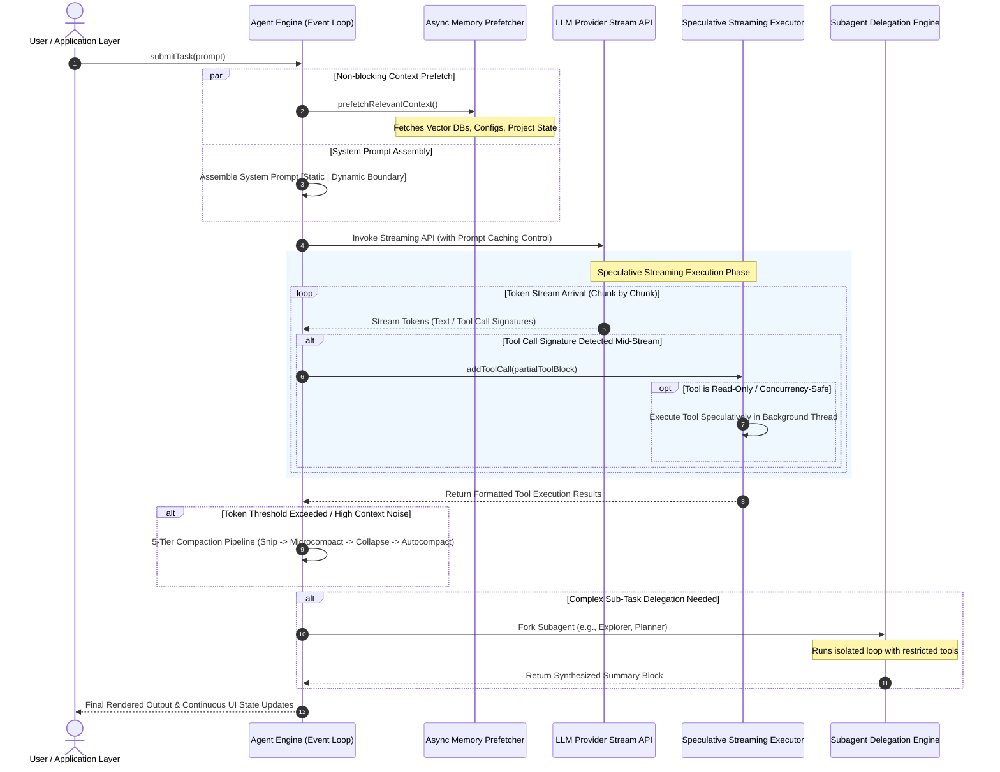

# Engineering Native LLM Agents: The Definitive Architecture Guide

## Introduction: The Evolution of LLM Agents

The first generation of LLM applications relied on a simplistic, synchronous request-response paradigm: *User Prompt → LLM Generation → Tool Execution → LLM Response*. While functional for basic chatbots, this sequential architecture breaks down when applied to complex, multi-step agentic workflows (like software engineering, data analysis, or deep research). 

Sequential wrappers suffer from three fatal flaws:
1. **Unacceptable Latency**: Users wait idly while the LLM generates a full response, then wait again while a tool executes, and wait *again* for the LLM to process the result.
2. **Context Window Collapse**: Dumping raw tool outputs (e.g., 10,000 lines of file reads or database queries) directly into the prompt quickly exhausts context limits, degrades the model's reasoning capabilities, and skyrockets API costs.
3. **Fragile Execution**: A single failed tool call or API error (`413 Payload Too Large`) crashes the entire agent loop, losing the user's progress.

This document details a **universal, production-grade architectural blueprint** for building "native" agentic systems. By treating the agent as a **reactive, multi-threaded operating system loop**, we can achieve sub-second perceived latency, infinite theoretical task horizons, and robust fault tolerance.

---

## 1. High-Level System Architecture

A native agentic system discards synchronous blocking in favor of a **reactive, streaming event loop**. It leverages speculative execution, strict prompt cache partitioning, and aggressive context compression.



---

## 2. Pillar 1: The Reactive Agentic Event Loop

At the foundation of a high-performance agent is an asynchronous, event-driven loop implemented as an `AsyncGenerator`. It maintains an immutable state across turns and yields discrete events (stream deltas, progress markers, tool lifecycle events) to keep the UI deeply responsive.

### The State Machine and Generator Pattern

Instead of a monolithic function returning a string, the core loop is a state machine that yields control back to the consumer constantly.

```typescript
// Core Event Types for UI Responsiveness
export type AgentStreamEvent = 
  | { type: 'stream_start'; turnId: string }
  | { type: 'token_delta'; text: string }
  | { type: 'tool_call_start'; toolName: string; id: string }
  | { type: 'tool_call_complete'; id: string; durationMs: number; result: unknown }
  | { type: 'context_compacted'; previousTokens: number; newTokens: number }
  | { type: 'tombstone'; messageId: string; reason: string }; // For invalidating broken streams

export interface LoopState {
  messages: Message[];
  turnCount: number;
  contextBudget: number;
  activeTurnId: string;
}

export async function* runAgentLoop(
  params: AgentLoopParams
): AsyncGenerator<AgentStreamEvent, TurnResult> {
  let state: LoopState = {
    messages: params.initialMessages,
    turnCount: 1,
    contextBudget: params.maxTokens,
    activeTurnId: generateUuid(),
  };

  // 1. Kick off asynchronous memory prefetching immediately.
  // Using the 'using' keyword ensures resource cleanup upon generator exit.
  using memoryPrefetchTask = startAsyncContextPrefetch(state.messages);

  // Main Event Loop
  while (true) {
    yield { type: 'stream_start', turnId: state.activeTurnId };

    // 2. Pre-flight Context Hygiene
    let activeMessages = prepareActiveContext(state.messages);
    if (shouldCompactContext(activeMessages, state.contextBudget)) {
      activeMessages = await executeCompactionPipeline(activeMessages);
      yield { type: 'context_compacted', ...getCompactionStats() };
    }

    // 3. Initialize the Speculative Executor for this specific turn
    const toolExecutor = new StreamingToolExecutor(params.availableTools);

    // 4. Stream LLM tokens and feed the speculative executor on-the-fly
    const llmStream = params.modelClient.stream({
      messages: activeMessages,
      systemPrompt: params.assembledSystemPrompt,
      tools: params.availableTools,
    });

    for await (const chunk of llmStream) {
      if (chunk.type === 'text_delta') {
        yield { type: 'token_delta', text: chunk.text };
      } else if (chunk.type === 'tool_use_delta' || chunk.type === 'tool_use') {
        // As partial JSON chunks arrive, the executor buffers and parses them.
        // Once a valid schema is formed, it executes speculatively.
        toolExecutor.bufferAndExecuteSpeculatively(chunk, chunk.parentMessage);
      }
    }

    // 5. Await any remaining tool executions that didn't finish during the stream
    const toolResults = await toolExecutor.getFinalResults();
    
    // Loop Termination: The model did not invoke any further tools
    if (toolResults.length === 0) {
      break; 
    }

    // Append tool results and loop again
    state.messages.push(...toolResults);
    state.turnCount++;
    state.activeTurnId = generateUuid();
  }

  return { status: 'success', finalMessages: state.messages };
}
```

---

## 3. Pillar 2: Speculative Streaming Tool Executor

The **Speculative Streaming Tool Executor** is the key to sub-second perceived latency. By using a streaming JSON parser (like `partial-json` or a custom buffer), the engine detects tool calls *while the model is still generating subsequent text or other tool calls*.

### Concurrency and Safety Boundaries

Not all tools can run simultaneously. Executing two file-write operations concurrently could cause race conditions. We must classify tools by their **Concurrency Safety**.

```typescript
export interface TrackedToolCall {
  id: string;
  name: string;
  input: Record<string, unknown>;
  status: 'buffering' | 'queued' | 'executing' | 'completed' | 'failed';
  isConcurrencySafe: boolean;
  result?: unknown;
  error?: Error;
}

export class StreamingToolExecutor {
  private executionQueue: TrackedToolCall[] = [];
  // Centralized cancellation token for this execution batch
  private siblingAbortController = new AbortController();

  constructor(private readonly toolsRegistry: Map<string, AgentTool>) {}

  // Called continuously as chunks arrive from the LLM
  public bufferAndExecuteSpeculatively(chunk: ToolStreamChunk, parentMessage: Message): void {
    const parsedInput = attemptParsePartialJson(chunk.partialJson);
    if (!parsedInput.isComplete) return; // Keep buffering

    const toolDef = this.toolsRegistry.get(chunk.name);
    
    // Classify tool safety: Read-only operations (grep, read_file, search) are safe.
    const isConcurrencySafe = toolDef ? toolDef.isReadOnly(parsedInput.data) : false;

    const trackedCall: TrackedToolCall = {
      id: chunk.id,
      name: chunk.name,
      input: parsedInput.data,
      status: 'queued',
      isConcurrencySafe,
    };

    this.executionQueue.push(trackedCall);

    // Trigger processing pipeline speculatively in the background
    void this.processQueue();
  }

  private async processQueue(): Promise<void> {
    for (const call of this.executionQueue) {
      if (call.status !== 'queued') continue;

      if (this.canExecute(call.isConcurrencySafe)) {
        // Fire and forget (promise handled internally)
        void this.executeCall(call);
      } else if (!call.isConcurrencySafe) {
        // MUTEX LOCK: Halt the queue. Non-concurrent tools must wait until 
        // all currently executing tools finish to preserve state ordering.
        break;
      }
    }
  }

  private canExecute(isConcurrencySafe: boolean): boolean {
    const activeExecutions = this.executionQueue.filter(c => c.status === 'executing');
    // Allow execution if nothing is running, OR if the new tool is safe AND all currently running tools are safe.
    return (
      activeExecutions.length === 0 ||
      (isConcurrencySafe && activeExecutions.every(c => c.isConcurrencySafe))
    );
  }

  private async executeCall(call: TrackedToolCall): Promise<void> {
    call.status = 'executing';
    try {
      const tool = this.toolsRegistry.get(call.name)!;
      // Pass the cancellation token to the tool's internal logic
      call.result = await tool.run(call.input, {
        signal: this.siblingAbortController.signal,
      });
      call.status = 'completed';
      
      // Since a tool finished, check if blocked non-concurrent tools can now run
      void this.processQueue(); 
    } catch (error) {
      // SIBLING CANCELLATION: If a tool fails critically (e.g., syntax error in a shell command),
      // we must abort all other speculatively running tools in this batch to prevent cascading failures.
      this.siblingAbortController.abort();
      call.status = 'failed';
      call.error = error;
    }
  }
}
```

---

## 4. Pillar 3: Multi-Tier Context Compaction (The 5-Tier Pipeline)

LLM context windows are finite and expensive. Pushing raw outputs directly into the context degrades the model's ability to reason ("lost in the middle" phenomenon). Production systems require an aggressive, multi-layered approach to context hygiene.

### The 5-Tier Pipeline Architecture

1.  **Tier 1: HISTORY SNIPPING (Token Decay)**
    *   **Concept**: Tool outputs from 10 turns ago are rarely relevant to the current objective. 
    *   **Action**: Completely remove old tool outputs (e.g., retaining only the last 5 turns of full tool data).
2.  **Tier 2: MICROCOMPACTING (Schema Preservation)**
    *   **Concept**: LLM APIs strictly enforce schema validation. You cannot simply delete a `tool_result` message if the preceding message has a `tool_call`.
    *   **Action**: Strip the massive data payload (e.g., a 10MB file read) and replace it with a lightweight placeholder string, while keeping the `tool_call_id` intact.
3.  **Tier 3: CONTEXT COLLAPSING (Semantic Summarization)**
    *   **Concept**: Long chains of back-and-forth debugging (e.g., trying to fix a compiler error 5 times) add noise.
    *   **Action**: Use a fast, cheap model to summarize a block of 6 messages into a single `assistant` message detailing the attempts and the final outcome.
4.  **Tier 4: AUTOCOMPACTING (Background Forking)**
    *   **Concept**: The total token count is nearing the absolute limit (e.g., 90% capacity).
    *   **Action**: Pause the main loop. Fork a background agent to read the entire history and generate a comprehensive "Current State of the World" summary. Replace the entire history (except the original system prompt and the latest user request) with this summary.
5.  **Tier 5: REACTIVE RECOVERY (Fault Tolerance)**
    *   **Concept**: Despite all proactive measures, an API request fails with a `413 Payload Too Large` error.
    *   **Action**: Wrap the LLM call in a `try/catch`. On `413`, aggressively trigger Tier 4 Autocompaction dynamically and retry the request automatically without crashing the user's session.

### Implementation: Microcompacting

```typescript
export const PAYLOAD_TRIMMED_MSG = '[Historical payload cleared to save context]';

export function microcompactHistory(
  messages: Message[],
  preserveFullPayloadTurns: number = 3
): Message[] {
  // Calculate cutoff based on turn pairs (user/assistant)
  const cutoffIndex = Math.max(0, messages.length - preserveFullPayloadTurns * 2);

  return messages.map((msg, idx) => {
    // Only compact tool result messages before the cutoff
    if (idx >= cutoffIndex || msg.role !== 'tool_result_role') return msg;

    const compactedContent = msg.content.map((block) => {
      if (block.type === 'tool_result' && getEstimatedTokens(block.content) > 1500) {
        return {
          ...block,
          content: PAYLOAD_TRIMMED_MSG, // Erase heavy payload
          // CRITICAL: Must retain block.tool_call_id to satisfy API schema validators
        };
      }
      return block;
    });

    return { ...msg, content: compactedContent };
  });
}
```

---

## 5. Pillar 4: Prompt Cache Boundary Optimization

Modern LLM providers (Anthropic, OpenAI) offer **Prompt Caching** (KV caching), which reduces latency and cost by caching the computation of identical prefixes. However, prompt caching requires **exact byte-for-byte prefix matching**.

If you inject dynamic context (e.g., the current time, the user's active file, or Git status) at the *top* of your system prompt, the cache is invalidated on every single turn, costing you valuable seconds of latency.

### The Static / Dynamic Boundary Pattern

You must strictly partition your system prompt using a boundary marker.

```typescript
export const SYSTEM_PROMPT_DYNAMIC_BOUNDARY = '___DYNAMIC_CONTEXT_BOUNDARY___';

export function assembleCacheOptimizedSystemPrompt(
  staticGuidelines: string[], // Invariant instructions, tool schemas, persona
  dynamicState: Record<string, string> // CWD, time, git status, OS memory
): SystemPromptBlock[] {
  
  // 1. The Static Block: Highly cacheable across turns and even different users.
  const staticBlock = {
    type: 'text',
    text: staticGuidelines.join('\n\n'),
    cacheControl: { type: 'ephemeral' } // Directs the API provider to cache up to this point
  };

  // 2. The Boundary Marker
  const boundaryBlock = {
    type: 'text',
    text: `\n${SYSTEM_PROMPT_DYNAMIC_BOUNDARY}\n`
  };

  // 3. The Dynamic Block: Appended strictly AFTER the cached prefix.
  const dynamicString = Object.entries(dynamicState)
    .map(([key, val]) => `<env_${key}>\n${val}\n</env_${key}>`)
    .join('\n');

  const dynamicBlock = {
    type: 'text',
    text: `Dynamic Session Context:\n${dynamicString}`
  };

  return [staticBlock, boundaryBlock, dynamicBlock];
}
```

**Result**: 90%+ of your input tokens hit the KV cache, reducing a 5-second time-to-first-token down to ~200 milliseconds.

---

## 6. Pillar 5: Asynchronous Memory & Context Prefetching

Native agents require vast amounts of context (vector searches over the codebase, reading project `.md` guidelines, fetching user preferences). Doing this sequentially before calling the LLM introduces massive lag.

By initiating these lookups asynchronously at the very beginning of the turn (`startAsyncContextPrefetch`), the database or file system I/O occurs concurrently while the CPU is assembling the complex system prompt arrays. 

Because modern asynchronous runtimes (Node.js, Python asyncio) are non-blocking, the latency of memory retrieval is effectively hidden underneath the necessary setup computation.

---

## 7. Pillar 6: Subagent Delegation & Thread Isolation

Complex tasks (e.g., "Analyze this repository and write a migration plan") require extensive exploration. If the main agent thread performs dozens of file reads and semantic searches, the main thread's context becomes irreparably polluted with irrelevant code snippets.

**The Solution:** Treat the main agent as a Thread Manager, and delegate exploratory work to isolated Subagents.

```typescript
// Subagent Execution and Context Isolation Pattern
export async function spawnSubagent(
  subagentType: 'explorer' | 'planner' | 'verifier',
  taskPrompt: string,
  parentContext: AgentContext
): Promise<SubagentResultSummary> {
  
  // 1. Create a scoped, isolated child context (forking the state)
  const childContext = parentContext.fork();

  // 2. Select restricted toolsets. 
  // e.g., An 'explorer' agent gets searching/reading tools, but no write permissions.
  const scopedTools = getToolsForRole(subagentType);

  // 3. Run the isolated subagent event loop
  const childLoop = runAgentLoop({
    initialMessages: [{ role: 'user', content: taskPrompt }],
    availableTools: scopedTools,
    systemPrompt: getSubagentPrompt(subagentType),
    contextBudget: 30000, // Smaller budget for focused tasks
  });

  let rawExplorationOutput = '';
  for await (const event of childLoop) {
    if (event.type === 'token_delta') {
      rawExplorationOutput += event.text;
    }
  }

  // 4. Synthesize the raw output. Do NOT return the raw file reads to the parent.
  const synthesis = await synthesizeSubagentFindings(rawExplorationOutput, subagentType);

  // 5. Return ONLY a high-level summary block to the main parent thread.
  return {
    summaryBlock: `<subagent_report type="${subagentType}">\n${synthesis}\n</subagent_report>`
  };
}
```

---

## 8. The Implementation Roadmap

To build a production-grade, native LLM agent engine, follow this phased implementation strategy:

### Phase 1: Core Loop & Streaming
1. Discard standard synchronous SDK wrappers.
2. Implement the `AsyncGenerator` event loop (`runAgentLoop`).
3. Connect UI rendering logic to consume `token_delta` and `tool_call_start` events for immediate user feedback.

### Phase 2: Performance & Speculation
1. Implement the `StreamingToolExecutor`.
2. Write a robust partial JSON parser to detect tool signatures mid-stream.
3. Categorize all your tools with an `isConcurrencySafe` flag.
4. Implement the `AbortController` sibling cancellation pattern to handle batch execution errors gracefully.

### Phase 3: Resilience & Caching
1. Restructure your system prompts using the `SYSTEM_PROMPT_DYNAMIC_BOUNDARY` pattern.
2. Add caching headers to the static arrays.
3. Implement Tier 2 (Microcompacting) and Tier 5 (Reactive Error Recovery) of the compaction pipeline to guarantee the loop never crashes on context overflows.

### Phase 4: Autonomy Expansion
1. Implement the Subagent Delegation architecture.
2. Create specialized prompts and restricted toolsets for `Explorer` and `Planner` agents.
3. Wire the subagent summarization engine to feed clean data back into the main loop. 

By adhering to these architectural pillars, you elevate an LLM from a simple chat interface into a robust, autonomous, and lightning-fast software agent capable of executing unbounded workflows.