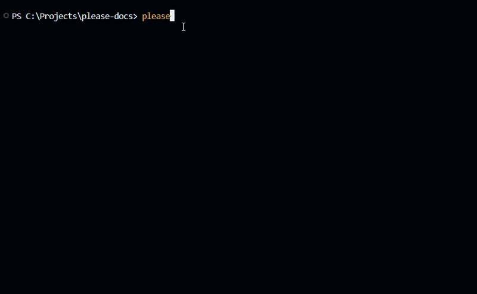

<div align="center">
    
<h1>Please</h1>
</div>

<h3 align="center">An AI native git CLI, built so you never have to type a raw git command again.</h3>

<p align="center">
  <a href="https://please.hylith.com">Documentation and Installation</a>
</p>

---

<p align="center">
 <a href="https://github.com/HylithLabs/please/actions/workflows/ci.yml">
  
 </a>
 <a href="https://github.com/HylithLabs/please/blob/main/LICENSE">
  
 </a>
 <a href="#contributing">
  
 </a>
</p>

---

## Table of Contents

* [Demonstration](#demo)
* [Introduction](#introduction)
  * [Documentation](#documentation)
* [Install](#install)
* [Setup](#setup)
* [Design Philosophy](#design-philosophy)
* [Contributing](#contributing)
* [Roadmap](#roadmap)
* [Security](#security)
* [License](#license)

## Demonstration

<p align="center">
  
</p>

## Introduction

Please is an AI native interface for git, built to remove the friction of remembering and typing raw git commands by hand. Instead of composing git (and gh) commands yourself, you describe an intent through a please command, and an AI agent of your choosing (Anthropic Claude, Google Gemini, or OpenAI ChatGPT) handles staging, commit messages, branching, and pushing on your behalf.

Git remains the engine underneath. Please is simply the interface placed on top of it. Every operation still executes as real git under the hood, so nothing about your history or workflow is reinvented, and your repository stays fully compatible with any other git tool or collaborator you work with.

Please is forgiving by design. Typos and filler words do not block a command: `please swich to master` still runs `please switch master`. A mistyped command word is recognized when it is one edit away from a real command and is not also close to some other command, and small connector words such as "to", "into", "the", "a", and "an" are dropped before the real argument is passed through. Anything looser than that is intentionally left alone and handed to the AI agent instead, so a request like "clean up my messy code" prompts the AI to review your code rather than silently running `please cleanup` and deleting branches.

Run `please` with no arguments, or `please help`, at any time for a full, grouped command reference directly in your terminal.


### Documentation

Full documentation, including installation guides, setup walkthroughs, and command references, is published at [please.hylith.com](https://please.hylith.com).

## Install

macOS and Linux:

```bash
curl --proto '=https' --tlsv1.2 -LsSf https://github.com/HylithLabs/please/releases/latest/download/please-installer.sh | sh
```

Windows (PowerShell):

```powershell
powershell -ExecutionPolicy Bypass -c "irm https://github.com/HylithLabs/please/releases/latest/download/please-installer.ps1 | iex"
```

Homebrew:

```bash
brew install HylithLabs/please/please
```

You can also build it yourself with `cargo install --path .` if you would rather not run a prebuilt binary. Note that `please update` only works for the prebuilt installs listed above, since a source build has no release archive to update itself from.

## Setup

Run once per machine:

```bash
please setup
```

You will choose a provider, Anthropic (Claude), Google (Gemini), or OpenAI (ChatGPT), and paste an API key. Please validates the key against the provider immediately with a real, low cost call, so a typo is caught right away instead of failing confusingly on your first `please commit`. It then automatically selects the cheapest model your key has access to, though you may decline the suggestion and enter a specific model id yourself. This configuration is saved globally to `~/.please/config` and applies to every project on the machine.

You may save keys for more than one provider, switch which one is active at any time, and change a saved provider's model later without re-entering its key. Running `please setup` again shows what is already configured, then lets you add, switch, update, or remove providers.

The first time please is used in a repository, it also generates a short project description cached at `.git/PLEASE.MD`, giving the AI context about the codebase it is working in.

## Design Philosophy

Please is guided by a small set of principles that shape every command added to it.

No hand written git. Every git operation a developer needs should be reachable through a please command.

Explicit overrides rather than blanket blocks. Guardrails, such as those protecting sensitive files or junk directories, can always be bypassed by staging the file yourself first. The tool assumes intent over blocking outright.

Bounded AI latency. A model's own response time is not something please controls, but everything around it is. Requests are timeout bounded, progress is printed so the CLI never appears frozen, and a model is selected once at setup rather than re-selected on every call.

Confirmation for anything destructive. Any operation that can discard work explains its consequences up front and requires explicit confirmation before proceeding.

## Contributing

To contribute to please, please refer to our [CONTRIBUTING.md](CONTRIBUTING.md) document. It covers how the project is laid out, how to add a new command, and what is expected before opening a pull request. If you need further information, please [open an issue](https://github.com/HylithLabs/please/issues/new).

Please also review our [Code of Conduct](CODE_OF_CONDUCT.md) before participating.

## Roadmap

See `PROJECT.MD` for the full vision, including the planned Auto Commit feature, where the AI commits automatically as you reach meaningful checkpoints with no command needed, and a configuration GUI.

## Security

If you discover a security vulnerability, please do not open a public issue. See [SECURITY.md](SECURITY.md) for how to report it responsibly.

## License

Please is published under the [Apache 2.0 license](LICENSE).

<p align="center">
  
</p>
